Due Sunday April 3, 12:00PM Central.

Submit the pdf via Gradescope. You will create this repo in step 9.

This submission is my work alone and complies with the 30535 integrity
policy.

Add your initials to indicate your agreement: **KEZG**

Add names of anyone you discussed this problem set with: **No**

Late coins used this pset: 0. Late coins left after submission: 5.

Name your submission files `skills_ps_1.Rmd` and `skills_ps_1.html`
**(10 points)**.

We use a `*` to indicate a problem that we think might be time
consuming.

# 1. Setup

### 1.1 Installation (10 points)

1.  Install R from <https://www.r-project.org>
2.  Install Rstudio from <http://www.rstudio.com>
3.  Open RStudio. Go to preferences. Uncheck “Restore .Rdata into
    workspace on startup”. Set “Save workspace to .Rdata on exit” to
    “never”.
4.  Install the `devtools` package using `install.packages("devtools")`

<!-- -->

    install.packages("devtools")

1.  Install all the packages used in the book using
    `devtools::install_github("hadley/r4ds")`

<!-- -->

    devtools::install_github("hadley/r4ds")

    install.packages("remotes")
    remotes::install_github("hadley/r4ds")

1.  For students who do not already have a github account, set up a
    github account.

2.  Download Github Desktop [here](https://desktop.github.com/). If you
    are familar with using `git` through the command line you are
    welcome to do so.

3.  Watch the first two “git primer” videos (parts 1 and 2). Videos can
    be found in Canvas under Modules.

4.  Initialize your ps1 repository and download the pset\_template
    [here](https://classroom.github.com/a/fZw1nLTy). Please read the
    README file which is visible on the repo’s homepage.

    1.  Use `pset_template.Rmd` to get started capturing your answers
        and submit onto Gradescope. Students upload RMD and knitted HTML
        document to Github and then upload the knitted PDF document and
        submit it to Gradescope.

1.  Install these packages

<!-- -->

        list_of_packages <- c("r4ds")
        install.packages(list_of_packages)
        #Installing all R4ds packages

1.  Run a line of code which tests the packages are installed using
    Stackoverflow instructions posted \[here\]. Print `new.packages` and
    record the output in your problem set. This lets us know which
    packages successfully installed and which ones didn’t.

<!-- -->

    new.packages <- list_of_packages[!(list_of_packages %in% installed.packages()[,"Package"])]
    if(length(new.packages)) install.packages(new.packages)

-   In my R console when I print “new packages” I get the message
    “character(0)”, but when I knit I get a long code.

<!-- -->

    new.packages

    ## function (lib.loc = NULL, repos = getOption("repos"), contriburl = contrib.url(repos, 
    ##     type), instPkgs = installed.packages(lib.loc = lib.loc, ...), 
    ##     method, available = NULL, ask = FALSE, ..., type = getOption("pkgType")) 
    ## {
    ##     if (!is.character(type)) 
    ##         stop("invalid 'type'; must be a character string")
    ##     ask
    ##     if (type == "both" && (!missing(contriburl) || !is.null(available))) {
    ##         stop("specifying 'contriburl' or 'available' requires a single type, not type = \"both\"")
    ##     }
    ##     if (is.null(lib.loc)) 
    ##         lib.loc <- .libPaths()
    ##     if (!is.matrix(instPkgs)) 
    ##         stop(gettextf("no installed packages for (invalid?) 'lib.loc=%s'", 
    ##             lib.loc), domain = NA)
    ##     if (is.null(available)) 
    ##         available <- available.packages(contriburl = contriburl, 
    ##             method = method, ...)
    ##     installed <- unique(instPkgs[, "Package"])
    ##     poss <- sort(unique(available[, "Package"]))
    ##     res <- setdiff(poss, installed)
    ##     update <- character()
    ##     graphics <- FALSE
    ##     if (is.character(ask) && ask == "graphics") {
    ##         ask <- TRUE
    ##         if (.Platform$OS.type == "windows" || .Platform$GUI == 
    ##             "AQUA" || (capabilities("tcltk") && capabilities("X11"))) 
    ##             graphics <- TRUE
    ##     }
    ##     if (isTRUE(ask)) {
    ##         if (length(res)) 
    ##             update <- res[match(select.list(res, multiple = TRUE, 
    ##                 title = "New packages to be installed", graphics = graphics), 
    ##                 res)]
    ##         else message("no new packages are available")
    ##     }
    ##     if (length(update)) {
    ##         if (type == "both") 
    ##             install.packages(update, lib = lib.loc[1L], method = method, 
    ##                 type = type, ...)
    ##         else install.packages(update, lib = lib.loc[1L], contriburl = contriburl, 
    ##             method = method, available = available, type = type, 
    ##             ...)
    ##         dirs <- list.files(lib.loc[1L])
    ##         updated <- update[update %in% dirs]
    ##         res <- res[!res %in% updated]
    ##     }
    ##     res
    ## }
    ## <bytecode: 0x7f9b4a19db68>
    ## <environment: namespace:utils>

1.  What is your github id? **khristel26**

2.  Add and commit your code. Push it to github with commit message
    “start-up completed”. **Done**

3.  Watch the third git primer video (part 3 of 3) Videos can be found
    in Canvas under modules. **Done**

4.  Now we’ll practice reverting. **Done**

<!-- -->

    a.  Add the following text to you homework: "Why did the code on Github delete tindr?"
    a.  Now push the code to Github. 
    a.  Now revert to the previous state of the code. (Now that the code is uncommitted, maybe it'll join tindr again.)

### 1.2 Affirm Data Use Agreements and Integrity Policy

1.  Complete the “Data Use Agreements” quiz on canvas **Done**
2.  Complete the “Integrity Policy Quiz” on canvas **Done**

# 2. R for Data Science Exercises

### 2.1 First Steps (10 points)

Load the `tidyverse` library. `tidyverse` comes with a dataset called
`mpg`.

    library(tidyverse)
    view(mpg)

1.  How many rows are in `mpg`? How many columns? What do the rows
    represent? How about the columns?

-   There are 234 rows and 11 columns in the ‘mpg’ dataset

<!-- -->

    nrow(mpg)

    ## [1] 234

    ncol(mpg)

    ## [1] 11

The rows contain cars with new release every year between 1999 and 2008,
and the columns contain their characteristics such as manufacturer,
model, displ, year, etc.

1.  Make a scatterplot of `hwy` vs `cyl`.

<!-- -->

    ggplot(data = mpg) +
    geom_point(mapping = aes(x = cyl, y = hwy)) +
    labs(x = "Number of cylinders <cyl>",
    y = "Highway miles per gallon <hwy>")

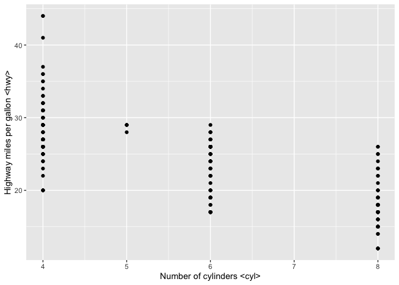

1.  What does the `drv` variable describe? Read the help for `?mpg` to
    find out.

<!-- -->

    ?mpg

‘drv’ indicates the vehicle’s drive train/transmission type, where f
means the car is front-wheel drive, r = rear-wheel drive, and 4 = 4wd.
It is a categorical variable, since it can only take three values.

1.  What happens if you make a scatterplot of `class` vs `drv`? Why is
    the plot not useful?

<!-- -->

    ggplot(data = mpg) +
    geom_point(mapping = aes(x = class, y = drv)) +
    labs(x = "Type of car <class>",
    y = "Type of drive train <drv>")

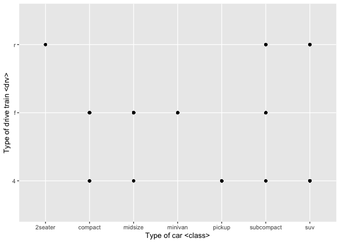

This plot is not useful because it only shows the coincidences between
two categorical variables (12 points are shown), not even the graph
shows which are the combinations that have more observations (it can be
found with geom\_count). In that sense, this chart does not provide
valuable information for analysis.

### 2.2 Grammar of graphics: Mapping data to aesthetics (25 points)

1.  Run `?mpg` to pull up the documentation for the dataset. Run
    `print(mpg)` to see the first 10 rows of the tibble. Notice the
    tibble header in the console includes the variable type
    (e.g. `<chr>` is character). Describe how the `<chr>`, `<int>` and
    `<dbl>` variable types map to whether a variable is categorical
    versus continuous.

<!-- -->

    ?mpg
    print(mpg)

    ## # A tibble: 234 × 11
    ##    manufacturer model      displ  year   cyl trans drv     cty   hwy fl    class
    ##    <chr>        <chr>      <dbl> <int> <int> <chr> <chr> <int> <int> <chr> <chr>
    ##  1 audi         a4           1.8  1999     4 auto… f        18    29 p     comp…
    ##  2 audi         a4           1.8  1999     4 manu… f        21    29 p     comp…
    ##  3 audi         a4           2    2008     4 manu… f        20    31 p     comp…
    ##  4 audi         a4           2    2008     4 auto… f        21    30 p     comp…
    ##  5 audi         a4           2.8  1999     6 auto… f        16    26 p     comp…
    ##  6 audi         a4           2.8  1999     6 manu… f        18    26 p     comp…
    ##  7 audi         a4           3.1  2008     6 auto… f        18    27 p     comp…
    ##  8 audi         a4 quattro   1.8  1999     4 manu… 4        18    26 p     comp…
    ##  9 audi         a4 quattro   1.8  1999     4 auto… 4        16    25 p     comp…
    ## 10 audi         a4 quattro   2    2008     4 manu… 4        20    28 p     comp…
    ## # … with 224 more rows

We can conclude that <chr> represents the categorical variables and
these are: ‘manufacter’, ‘mode’, ‘trans’, ‘drv’, ‘fl’ and ‘class’.

On the other hand, <int> maps to continuous variables that have
integers, in the dataset these are: ‘year’, ‘cyl’, cty’, ‘hwy’.

Finally, <dbl> represents continuous variables as ‘displ’.

1.  Graph the following two scatter plots.

        # Graph 1
        ggplot(data = mpg) +
          geom_point(mapping = aes(x = hwy, y = cty, color = year))

    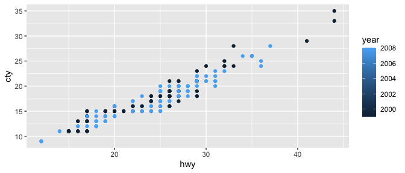

        # Graph 2
        ggplot(data = mpg) +
          geom_point(mapping = aes(x = hwy, y = cty, color = as.character(year)))

    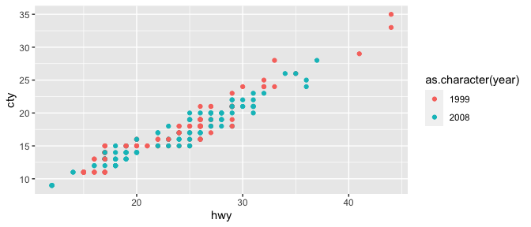

    -   Why are the two graphs different?

**The graphs are different because the first assumes a continuous
variable with years between 1999 and 2008, creating a possible range of
colors to differentiate the data for each year. However, in graph 1 we
only see two colors.**

**In graph two, the year is taken as a discrete variable (as.character),
a categorical variable that can only take two values. Therefore only two
colors**

    * Which graph is a better representation of the data?

**Due to the type of data available, graph 2 provides a better
representation, since the ‘years’ variable only takes two values in the
dataset.**

1.  What happens if you map an aesthetic to something other than a
    variable name, like `aes(color = displ < 5)`?

<!-- -->

        ggplot(data = mpg) +
          geom_point(mapping = aes(x = displ, y = hwy, color = displ< 5))

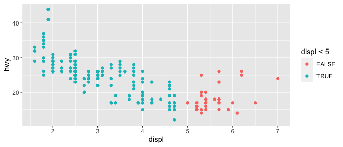
**In this case, ggplot continues plotting it and creates a temporary
variable (True, False) for the created condition (displ&lt;5). For
example, in this case we can see that values greater than 5 on the
‘displ’ x-axis are FALSE and those less than 5 are classified as True.**

1.  `*`Common bugs: What’s gone wrong with this code? Fix the code so
    the points are blue.

        ggplot(data = mpg) +
          geom_point(mapping = aes(x = displ, y = hwy, color = "blue"))

    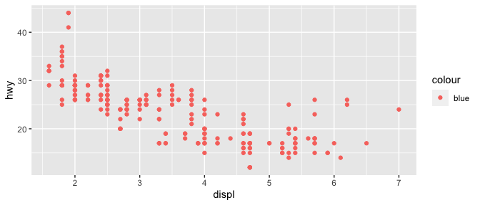
    **In this case, aes assumes that ‘color’ is being assigned the
    categorical variable ‘blue’; that is, it does not take it as the
    name of the color, but as the name of a variable, which in this case
    does not exist. In that sense, to fix the code, we must remove color
    from aes.**

Fixing the code:

        ggplot(data = mpg) +
          geom_point(mapping = aes(x = displ, y = hwy), color = "blue")

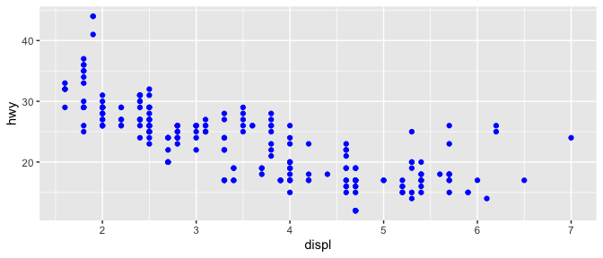

### 2.3 grammar of graphics: Facets (25 points)

1.  Make the following plots.

        ggplot(data = mpg) +
          geom_point(mapping = aes(x = displ, y = hwy)) +
          facet_grid(cols = vars(drv))

    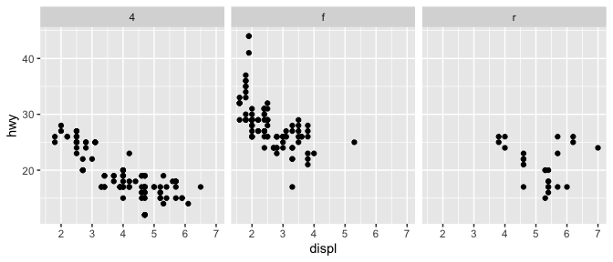

        ggplot(data = mpg) +
          geom_point(mapping = aes(x = displ, y = hwy)) +
          facet_grid(rows = vars(year))

    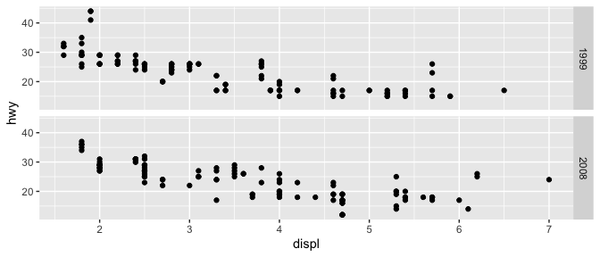

        ggplot(data = mpg) +
          geom_point(mapping = aes(x = displ, y = hwy)) +
          facet_grid(rows = vars(year), cols = vars(drv))

    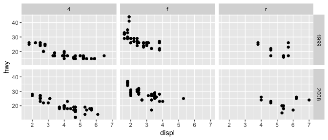

    -   How does `facet_grid()` decide the layout of the grid?

**This data comes from the configuration that the user gives it, either
organization by columns ‘cols’ or by rows ‘rows’. Also, put the code
‘vars’ followed by the name of the variable by which you want to
classify the data and see it in grids**

1.  What happens if you facet on a continuous variable? Provide an
    example.

A grid is created for each value of this continuous variable, and can
have as many columns or rows according to how many values this variable
has.

-   Example:

<!-- -->

     ggplot(data = mpg) +
          geom_point(mapping = aes(x = displ, y = hwy)) +
          facet_grid(cols = vars(cty))

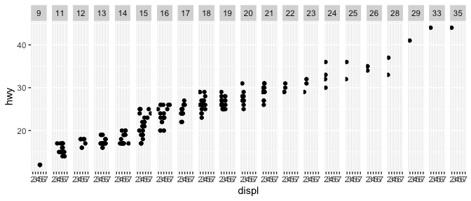

1.  Reproduce the following graph (hint:
    `theme(axis.text = element_text(size = 16))` makes the axis labels
    large).

<!-- -->

    ggplot(data = mpg) +
          geom_point(aes(x = class, y = hwy, color = class)) +
          facet_grid(rows = vars(year)) +
          theme(axis.text = element_text(size = 16))

1.  The x-axis labels for `class` on the plot may really hard to read!
    Can you rotate the labels by 45 degrees so that they don’t overlap
    one another? This would be a good time to use google. Include
    `ggplot` in your search to get more relevant answers. Remember to
    cite any code gathered from the internet.

<!-- -->

    ggplot(data = mpg) +
          geom_point(aes(x = class, y = hwy, color = class)) +
          facet_grid(rows = vars(year)) +
          theme(axis.text = element_text(size = 16, angle = 45, vjust = 0.5, hjust=1))

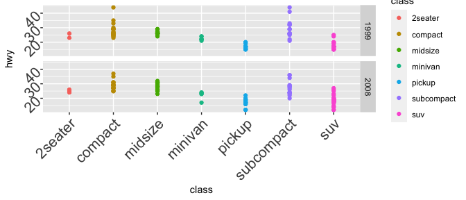

Source:
<https://stackoverflow.com/questions/1330989/rotating-and-spacing-axis-labels-in-ggplot2>

1.  `*`Reproduce the following graph. Why are so many manufacturers
    missing?

<!-- -->

    ggplot(data = mpg) +
      geom_point(aes(x = displ, y = hwy, shape = manufacturer)) +
      facet_grid(rows = vars(year), cols = vars(drv))

    ## Warning: The shape palette can deal with a maximum of 6 discrete values because
    ## more than 6 becomes difficult to discriminate; you have 15. Consider
    ## specifying shapes manually if you must have them.

    ## Warning: Removed 112 rows containing missing values (geom_point).

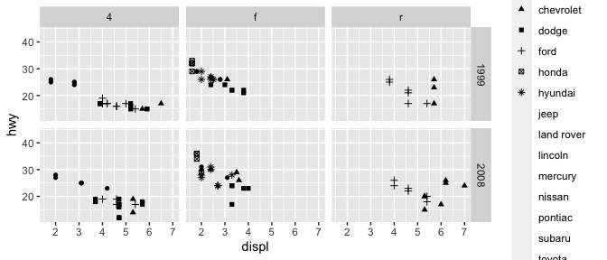

    ?shape

**This happens because the ‘shape’ function in ggplot can only plot six
figures at a time, the rest are being left unplotted.**

### 2.4 grammar of graphics: `geom`s (10 pts)

1.  What geom would you use to draw a line chart? A boxplot? A
    histogram? An area chart?

**I will use an area chart, because that would connect the points of the
graph**

1.  Will these two graphs look different? Why/why not?

        ggplot(data = mpg, mapping = aes(x = displ, y = hwy)) +
          geom_point() +
          geom_smooth(se = FALSE)

        ## `geom_smooth()` using method = 'loess' and formula 'y ~ x'

    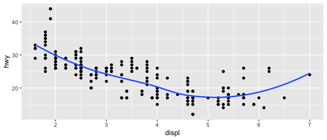

        ggplot() +
          geom_point(data = mpg, mapping = aes(x = displ, y = hwy)) +
          geom_smooth(data = mpg, mapping = aes(x = displ, y = hwy), se = FALSE)

        ## `geom_smooth()` using method = 'loess' and formula 'y ~ x'

    

**In this case, the graphics will be the same. This is because although
graph 1 is saying that the base of the ggplot will have certain
characteristics (x and y) and then specifying the geom point and smooth
(when the aes are set in the original ggplot, they are inherited by any
other geom that will be built on it) while plot 2 does not set features
for ggplot, the same features of ggplot plot 1 are found in geom\_point
and geom\_smooth (note that it is now mandatory for plot 2 to repeat the
features in geom\_point and geom\_smooth because they are not part of of
the principal ggplot).**

1.  You are investigating the connection between city gas mileage and
    car characteristics in your role as a policy analyst for a climate
    change organization. Write code to make this graph.

        ggplot(data = mpg, mapping = aes(x = displ, y = cty)) +
            geom_point(aes(color = drv)) +
            geom_smooth(se = FALSE)

    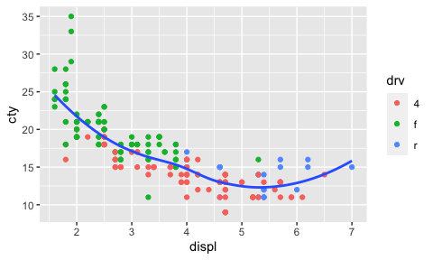

2.  \*Your colleague suggests you improve the graph by:

    -   make line black
    -   make the x- and y-axes labels more informative using `+ labs()`
    -   use an informative title to capture the headline finding of your
        analysis
    -   remove the legend (google might be helpful to learn how)

    Make these changes. Are all four changes improvements? Which change
    made the plot worse and why?

<!-- -->

        ggplot(data = mpg, mapping = aes(x = displ, y = cty)) + theme(legend.position="none") +  geom_point(aes(color = drv )) + geom_smooth(se = FALSE, color = "black") + 
      labs(x = "Engine displacement, in litres <displ>", y = "City miles per gallon <cty>", title = "City gas mileage and car characteristics") + theme(plot.title = element_text(face = "bold", size = 15, hjust = 0.5))

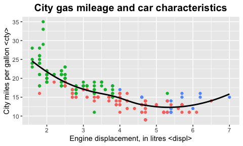

**Not all changes are improvements. The fact that the legend has been
removed left the colors of the graph unexplained and meaningless. In
that sense, removing the legend has made the chart worse and less
useful.**

Source for removing
legend:<https://stackoverflow.com/questions/35618260/remove-legend-ggplot-2-2>

### 2.4.1 grammar of graphics: Statistical transformations (10 pts)

1.  What does `geom_col()` do? How is it different from `geom_bar()`?

<!-- -->

    ?geom_col

**The geom\_col code uses the values of the variable X to graph the
bars, that is, the height of the bars represents the data values.
Meanwhile, geom\_bar uses the bars to represent the repetitions of the
data (it counts them), that is, the height of the bars is proportional
to the number of cases of each data.**

1.  Plot `ggplot(data=mpg, aes(x=hwy)) + geom_bar()`. Replace the `geom`
    with a `stat` to make the same graph.

<!-- -->

    ggplot(data=mpg, aes(x=hwy)) + geom_bar()

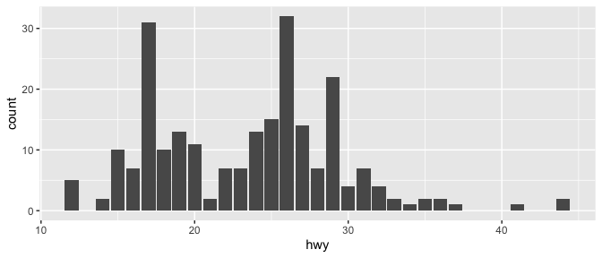

    ggplot(data=mpg, aes(x=hwy)) + stat_count()

1.  -   Which 4 variables does `stat_smooth()` compute?

<!-- -->

    ?stat_smooth

According to the help page, stat\_smooth() computes 4 variables: - y
predicted value - ymin: lower pointwise confidence interval around the
mean - ymax: upper pointwise confidence interval around the mean - SE:
standard error

    * How are these variables displayed on a graph made with `geom_smooth()`? 

    ggplot(data = mpg, mapping = aes(x = displ, y = hwy)) +
          geom_point() + stat_smooth()

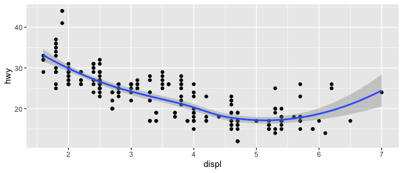

**From the graph we can see that the display of the confidence interval
is gray and the prediction of the variables is reflected in the blue
line. Likewise, the max number is the highest and the min is the lowest
that the blue line can take**

    * What parameters (i.e. inputs to the function) control its behaviour?

The parameters/inputs of stat\_smooth() that control its behavior are
the following, among others:

-   Standar Error: TRUE by default
-   level: level of confident interval
-   data: data to be displayed
-   mapping: Set of aesthetic mappings
-   formula: Formula to use in smoothing function
-   etc.

1.  Most `geom`s and `stat`s come in pairs. Read through the
    documentation and make a list of 5 pairs. Notice the ggplot syntax
    helps you to understand when a `geom` and a `stat` go together.

*Pairs of geom y stat:* - geom\_bar() and stat\_count() - geom\_col()
and stat\_identity() - geom\_qq() and stat\_qq() - geom\_qq\_line() and
stat\_qq\_line() - geom\_sf() and stat\_sf() - geom\_boxplot() and
stat\_boxplot() - geom\_function() and stat\_function()

1.  In our proportion bar chart, we need to set `group = 1`. Why do we
    need to specify this?
    -   If we didn’t specify this, what denominator would `ggplot` use
        by default?

    <!-- -->

        ggplot(data = diamonds) + 
          geom_bar(mapping = aes(x = cut, y = ..prop..))

    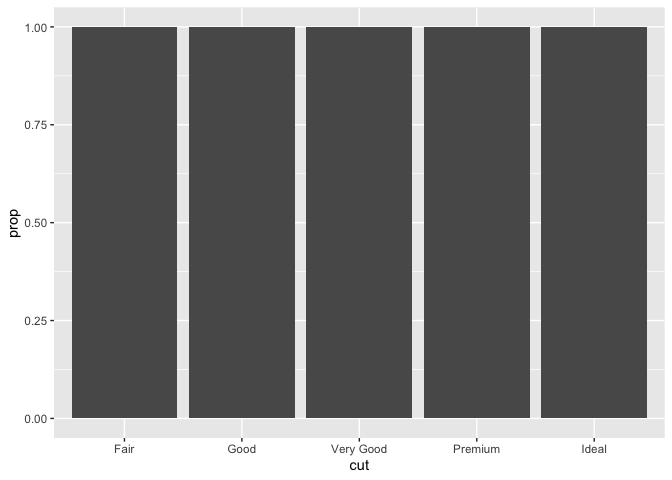

**The problem with the plot is that it uses specific proportions for
each subgroup, but nevertheless ggplot is taking the entire data to plot
it. In that sense, it is necessary to specify to R that the graph has
proportions by subgroup, putting ‘group=1’, as follows:**

      ggplot(data = diamonds) + 
          geom_bar(mapping = aes(x = cut, y = ..prop.., group = 1))

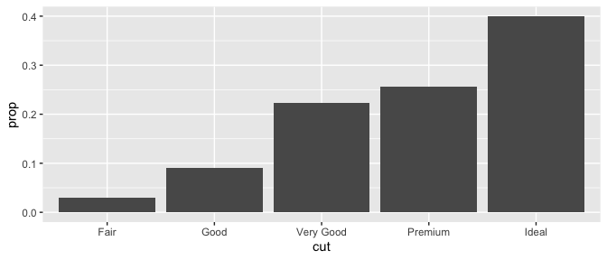

### 2.5 grammar of graphics: Positional adjustments (5 pts)

1.  What is the problem with this plot? How could you improve it?

        ggplot(data = mpg, mapping = aes(x = cty, y = hwy)) + 
          geom_point()

    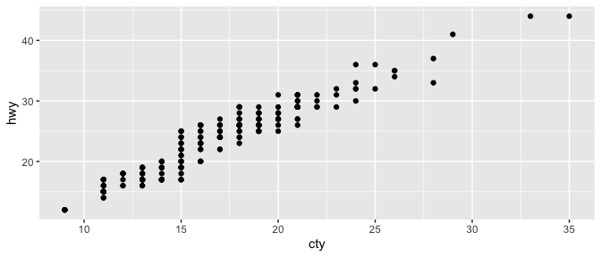

**Because some rows of the dataframe have the same values, there is an
overlapping of data; this causes the observer to be unable to identify
with certainty where the largest concentrations of data are found. We
can enhance the graph in three ways: using geom\_jitter, geom\_jitter or
making it transparent with alpha.**

-   Using geom\_jitter():

<!-- -->

        ggplot(data = mpg, mapping = aes(x = cty, y = hwy)) +  geom_point() + geom_jitter()

1.  Compare and contrast `geom_jitter()` with `geom_count()`. Use
    vocabulary from the “grammar of graphics” (see section headings) to
    support your argument.

<!-- -->

    ggplot(data = mpg, mapping = aes(x = cty, y = hwy)) +  geom_point() + geom_count()

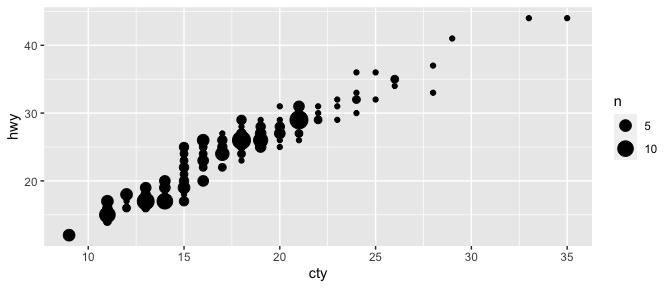

**The graphics generated by both codes are different. What `geom_jitter`
does is randomly move the points to avoid overlapping so we can display
them. On the other hand, `geom_count` determines the size of the points
according to the number of observations, the position of the points does
not change, but depending on the frequency and density of the points in
a certain area, the points may overlap.**

1.  `*`What’s the default position adjustment for `geom_bar()`? What did
    we add to the code to change the default behavior of geom\_bar?

    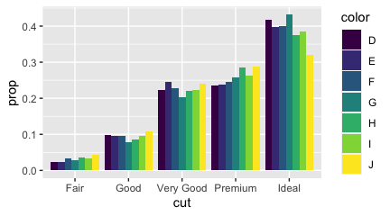

**The default position setting is that the variants within the group are
stacked (one on top of the other). However, in this graph the option
position = “dodge” has been added, which places overlapping objects
directly beside one another, making it easier to visualize and compare
individual values within the same group.**

### 2.6 grammar of graphics: Coordinate systems (5 pts)

1.  What happens when you use `coord_flip()`?

<!-- -->

    ?coord_flip

**What the code does is switches the x-axis and the y-axis, moving the
graph with it (graph horizontally, for example). Especially useful when
we have long labels or we want horizontal boxplots.**

1.  What does the plot below tell you about the relationship between
    city and highway mpg?
    -   What does `geom_abline()` do?
    -   Why is `coord_fixed()` important? (Hint: The effect will be more
        apparent if you make the plot in the console (*not Rmd*) and
        then drag the edges of the plot window to resize the graph.)

    <!-- -->

        ggplot(data = mpg, mapping = aes(x = cty, y = hwy)) +
          geom_point() + 
          geom_abline()+
          coord_fixed()

    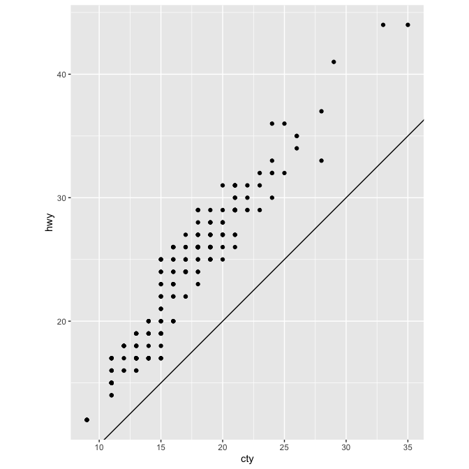

<!-- -->

    ?geom_abline
    ?coord_fixed()
    ?mpg

**The geom\_abline code adds a reference line to the graph. If the code
is given with no arguments (as in the current graph), R uses the default
values, intercept = 0 and slope = 1.In that sense, what the
coord\_fixed() code does is establish a specific graphing relationship
between the X and Y axes, to a value of ratio=1. That is, the X axis
will be the same length as the Y axis. This data visualization is
important, since it allows us to better observe the graph and therefore
reach conclusions sooner.Finally, from the graph we can conclude that
there is a direct and positive relationship between the variables ‘cty’
and ‘hwy’, that while the miles per gallon used in the city increases,
the performance of the highway miles per gallon also increases.**
